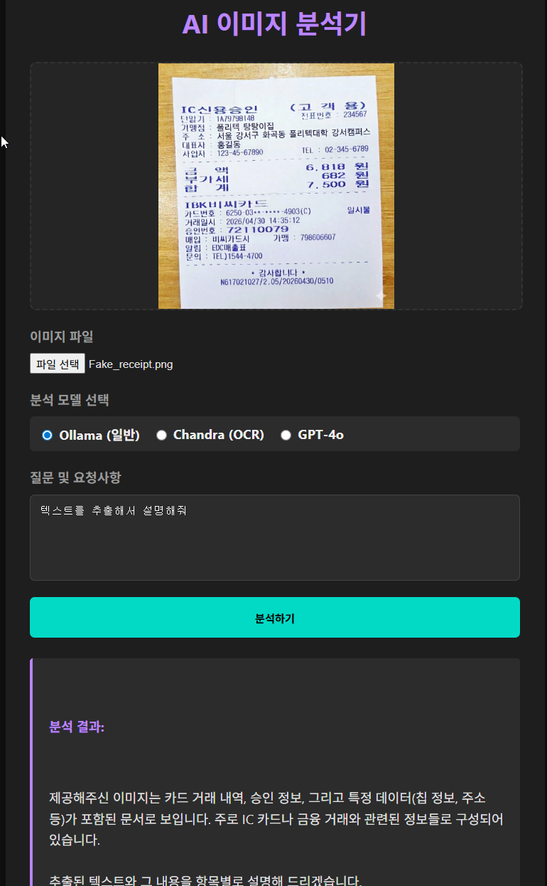
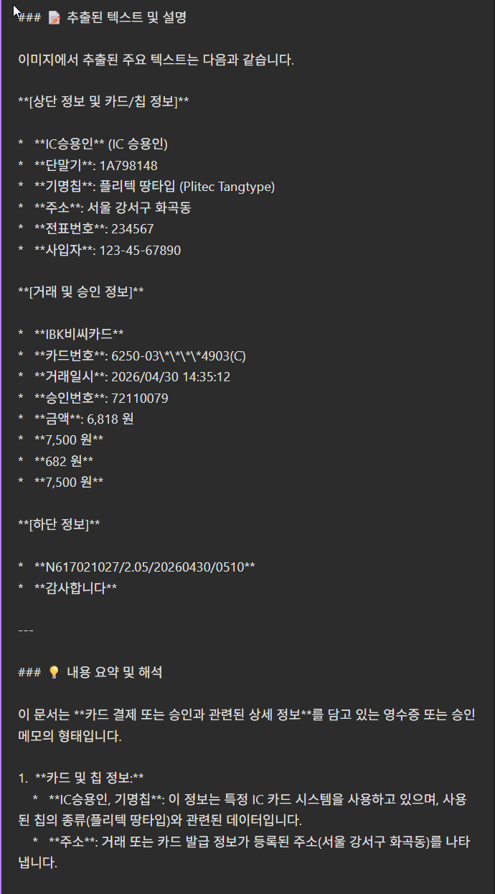
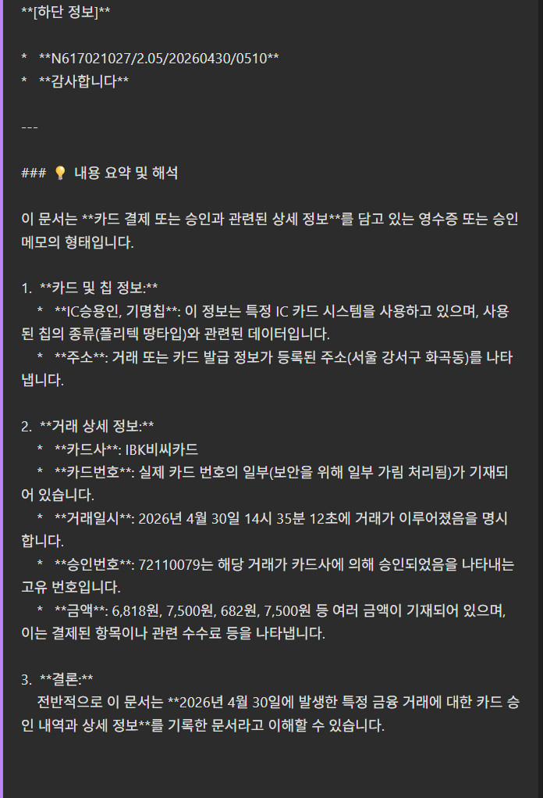
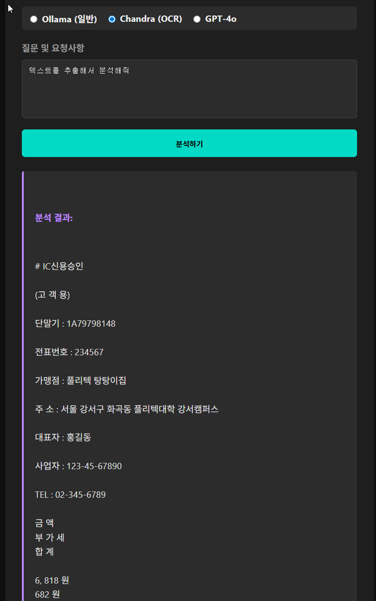
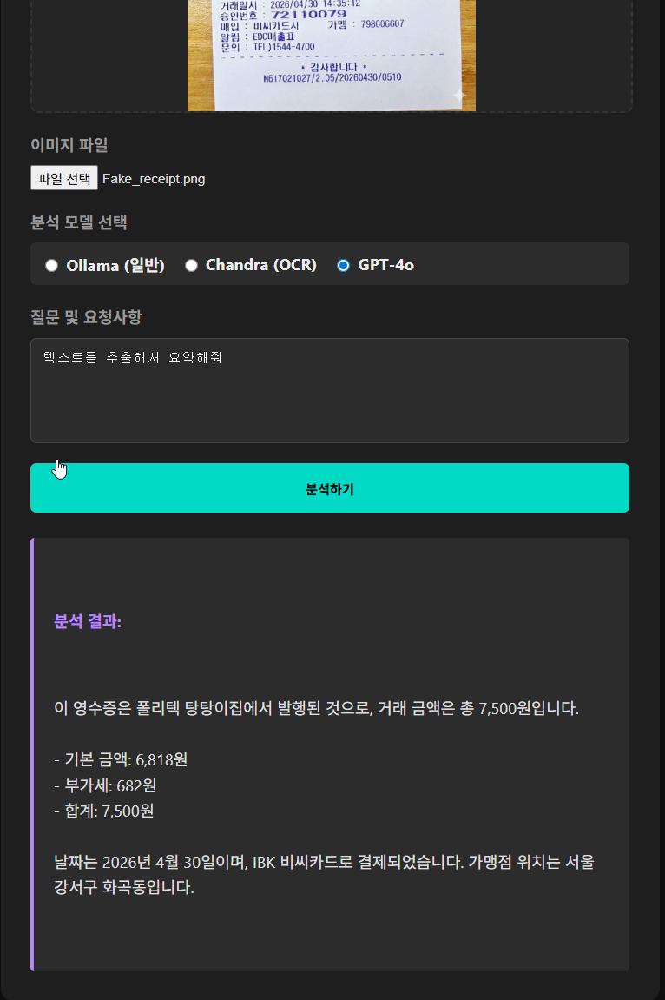
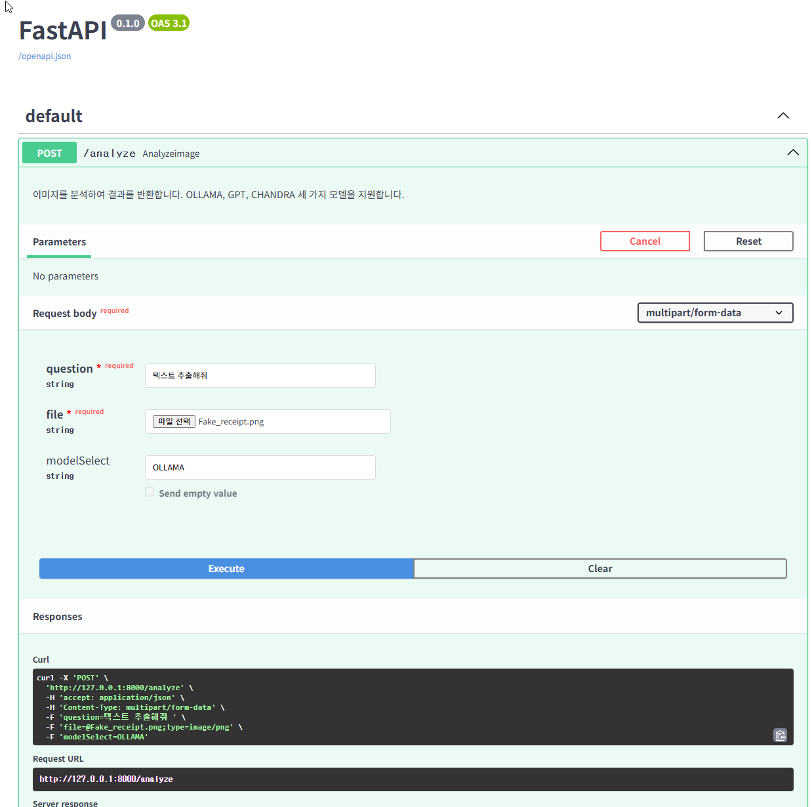
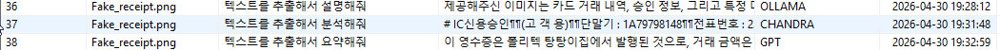

# AI Multi-Model Image Analysis Server

FastAPI 기반의 이미지 분석 및 OCR 서버입니다.  
사용자가 이미지를 업로드하고 질문을 입력하면, 선택한 AI 모델을 통해 분석 결과를 반환합니다.

본 프로젝트는 하나의 API에서 다음 3가지 모델을 선택해 사용할 수 있도록 구현했습니다.

- **OLLAMA**: 로컬 LLM 기반 이미지 분석
- **GPT-4o**: OpenAI Vision API 기반 이미지 분석
- **CHANDRA OCR**: HuggingFace 기반 OCR 및 문서 분석

분석 결과는 MySQL 데이터베이스에 저장되며, 간단한 웹 화면을 통해 이미지 업로드와 모델 선택이 가능합니다.

---

## 주요 기능

- 이미지 파일 업로드
- 질문 기반 이미지 분석
- OLLAMA / GPT-4o / CHANDRA OCR 모델 선택
- GPT-4o Vision API 연동
- HuggingFace 기반 Chandra OCR 연동
- MySQL 분석 결과 저장
- FastAPI Swagger 문서 제공
- 프론트엔드 웹 화면 연동
- GPU 인식 여부 확인 로그 출력

---

## 기술 스택

### Backend

- Python
- FastAPI
- Uvicorn
- MySQL
- python-dotenv
- python-multipart

### AI Model

- Ollama
- OpenAI GPT-4o
- Chandra OCR
- HuggingFace Transformers
- PyTorch

### Frontend

- HTML
- CSS
- JavaScript
- Node.js
- Express.js

---

## 프로젝트 구조

```text
AI_PROJECT/
├── images/                 # 구현 캡쳐 이미지
├── app.py                  # FastAPI 서버 실행 및 모델 분기 처리
├── requirements.txt        # Python 패키지 목록
├── AI_GUIDE.md             # 프로젝트 개발 표준 가이드
├── .env                    # API Key 및 DB 접속 정보
├── .gitignore              # Git 제외 파일 설정
│
├── dataset/                # 테스트 이미지 또는 분석용 데이터 폴더
│
├── src/
│   ├── __init__.py         # src 패키지 인식용 파일
│   └── database.py         # MySQL 연결 및 분석 결과 저장 로직
│
└── simple_web/
    ├── server.js           # Express 서버 및 백엔드 요청 중계
    ├── package.json        # Node.js 패키지 설정
    ├── package-lock.json   # 패키지 버전 고정 파일
    └── public/             # 정적 웹 파일
```

현재 프로젝트는 `app.py`를 중심으로 실행됩니다.  
초기 테스트용 파일이었던 `main.py`, `src/core.py`, `src/main.py`, `tests/test_core.py`는 삭제하여 구조를 단순화했습니다.

---

## 실행 방법

### 1. Python 가상환경 실행

```powershell
.venv\Scripts\activate
```

### 2. 패키지 설치

```bash
pip install -r requirements.txt
```

### 3. 환경 변수 설정

프로젝트 루트에 `.env` 파일을 생성합니다.

```env
OPENAI_API_KEY=your_openai_api_key
DB_HOST=localhost
DB_USER=root
DB_PASSWORD=your_password
DB_NAME=your_database_name
```

`.env` 파일은 API Key와 DB 비밀번호가 포함되므로 GitHub에 업로드하지 않습니다.

### 4. FastAPI 서버 실행

```bash
python app.py
```

또는

```bash
uvicorn app:app --reload
```

Swagger 문서:

```text
http://127.0.0.1:8000/docs
```

### 5. 프론트엔드 실행

```bash
cd simple_web
npm install
npm start
```

웹 접속:

```text
http://localhost:3001
```

---

## API 명세

### POST `/analyze`

이미지 파일, 질문, 모델 선택값을 전달하면 선택한 모델을 통해 분석 결과를 반환합니다.

### Request

| 필드명       | 타입    | 설명                    
|-------------|--------|------------------------
| question    | string | 이미지에 대해 질문할 내용  
| file        | file   | 분석할 이미지 파일        
| modelSelect | string | 사용할 모델 선택값        

### modelSelect 값

| 값      | 설명                       
|---------|---------------------------
| OLLAMA  | 로컬 Ollama 모델 사용       
| GPT     | OpenAI GPT-4o Vision 사용  
| CHANDRA | Chandra OCR 사용           

### Response 예시

```json
{
  "success": true,
  "fileName": "sample.png",
  "model": "GPT",
  "answer": "이미지 분석 결과입니다."
}
```

---

## 모델별 처리 방식

### OLLAMA

로컬 Ollama 모델을 사용하여 이미지와 질문을 분석합니다.

```text
이미지 + 질문 → Ollama 모델 → 분석 결과 반환
```

### GPT-4o

이미지를 Base64로 변환한 뒤 OpenAI GPT-4o Vision API에 전달합니다.

```text
이미지 파일 → Base64 변환 → GPT-4o API → 분석 결과 반환
```

PNG, JPG 등 이미지 타입 문제를 방지하기 위해 업로드된 파일의 실제 MIME 타입을 사용하도록 수정했습니다.

### CHANDRA OCR

HuggingFace 기반 Chandra OCR 모델을 사용하여 이미지 내 텍스트와 문서 구조를 분석합니다.

```text
이미지 파일 → PIL Image 변환 → Chandra OCR → OCR 결과 반환
```

---

## 데이터베이스 저장

분석 결과는 MySQL에 저장됩니다.

| 항목         | 설명               
|-------------|--------------------
| fileName    | 업로드된 파일명      
| question    | 사용자가 입력한 질문 
| answer      | 모델 분석 결과      
| modelSelect | 사용한 모델         
| createdAt   | 분석 요청 시간      

---

## 개발 중 주요 트러블슈팅

### 1. 프로젝트 진입점 혼란

`app.py`, `main.py`, `src/main.py`가 혼재되어 실행 기준이 불명확했습니다.

**해결**  
FastAPI 서버 역할을 하는 `app.py`를 중심으로 구조를 정리하고, 불필요한 테스트용 파일을 삭제했습니다.

---

### 2. 모델 선택값 전달 오류

프론트엔드에서는 `model`, 백엔드에서는 `modelSelect`를 사용해 모델 선택값이 제대로 전달되지 않았습니다.  
그 결과 CHANDRA를 선택해도 기본값인 OLLAMA로 실행되는 문제가 있었습니다.

**해결**  
프론트엔드, Express 서버, FastAPI 백엔드에서 모델 선택값 이름을 모두 `modelSelect`로 통일했습니다.

---

### 3. GPT-4o 이미지 타입 오류

GPT-4o 분석 시 이미지 MIME 타입을 `image/jpeg`로 고정해 PNG 파일 분석에 문제가 있었습니다.

**해결**

```python
mimeType = file.content_type or "image/jpeg"
```

업로드된 파일의 실제 MIME 타입을 읽어 GPT API에 전달하도록 수정했습니다.

---

### 4. PyTorch GPU 인식 문제

초기에는 CPU 전용 PyTorch가 설치되어 GPU를 사용할 수 없었습니다.

확인 결과:

```text
torch: 2.x.x+cpu
cuda available: False
```

**해결**

CUDA 지원 PyTorch를 다시 설치했습니다.

```powershell
pip uninstall torch torchvision torchaudio -y
pip install torch torchvision torchaudio --index-url https://download.pytorch.org/whl/cu126
```

---

### 5. Node.js 포트 충돌

프론트엔드 서버 실행 시 3000번 포트가 이미 사용 중이라는 오류가 발생했습니다.

```text
Error: listen EADDRINUSE: address already in use :::3000
```

**해결**

```powershell
netstat -ano | findstr :3000
taskkill /PID 프로세스번호 /F
```

---

### 6. Git 추적 파일 정리

`.venv`, `__pycache__` 등 GitHub에 올리지 않아야 하는 파일이 추적되고 있었습니다.

**해결**

`.gitignore`를 수정하고, 이미 추적 중이던 가상환경 폴더를 Git 추적 대상에서 제거했습니다.

```bash
git rm -r --cached .venv
```

---

## Git 커밋 세이브포인트

| 단계 | 커밋 메시지                                     | 내용 
|-----|------------------------------------------------|----------------------------------------
| 1   | refactor: simplify project structure           | 불필요한 실행 파일과 테스트 파일 제거 
| 2   | docs: update project guide and dependencies    | AI_GUIDE.md와 requirements.txt 업데이트 
| 3   | feat: implement multi model image analysis API | OLLAMA, GPT-4o, CHANDRA OCR 백엔드 연동 
| 4   | feat: connect frontend model selection         | 프론트엔드에서 모델 선택값 전달 
| 5   | chore: .venv 폴더 제거                          | 가상환경 폴더 Git 추적 제외 

---
## 실행 화면

## 실행 화면

### 1. Ollama 이미지 분석 화면

웹 화면에서 이미지를 업로드하고, `Ollama` 모델을 선택하여 이미지 분석을 수행했습니다.







---

### 2. Chandra OCR 분석 화면

동일한 이미지에 대해 `Chandra OCR` 모델을 선택하여 OCR 기반 텍스트 추출 및 문서 분석 결과를 확인했습니다.



---

### 3. GPT-4o 이미지 분석 화면

동일한 이미지에 대해 `GPT-4o` 모델을 선택하여 이미지 분석 결과를 확인했습니다.



---

### 4. Swagger API 테스트 화면

FastAPI에서 제공하는 Swagger 문서를 통해 `/analyze` API를 직접 테스트할 수 있습니다.



---

### 5. MySQL 저장 결과

분석 요청 결과가 MySQL 데이터베이스에 저장된 것을 확인했습니다.



---
## 현재 완성 상태

현재 다음 흐름이 정상적으로 동작합니다.

```text
웹 화면에서 이미지 업로드
→ 모델 선택
→ FastAPI 백엔드 요청
→ OLLAMA / GPT / CHANDRA 중 선택 모델 실행
→ 분석 결과 반환
→ MySQL 데이터베이스 저장
```

| 모델         | 연동 상태 |
|-------------|----------|
| OLLAMA      | 완료      |
| GPT-4o      | 완료      |
| CHANDRA OCR | 완료      |

---

## 향후 개선 방향

- 이미지 파일 크기 제한 기능 추가
- 분석 결과 조회 API 추가
- DB 저장 결과를 웹 화면에서 확인하는 기능 추가
- 모델별 응답 시간 측정
- GPT / Ollama 모델명을 `.env`로 분리
- Docker 기반 실행 환경 구성

---

## 프로젝트를 통해 배운 점

- FastAPI에서 이미지 파일 업로드를 처리하는 방법
- FormData를 이용해 프론트엔드와 백엔드 간 데이터를 전달하는 방법
- 여러 AI 모델을 하나의 API에서 선택적으로 실행하는 구조
- OpenAI GPT-4o Vision API 사용 방법
- HuggingFace 기반 OCR 모델 실행 방법
- PyTorch CUDA 환경 확인 방법
- MySQL에 분석 결과를 저장하는 방법
- Git 커밋을 기능 단위로 관리하는 방법